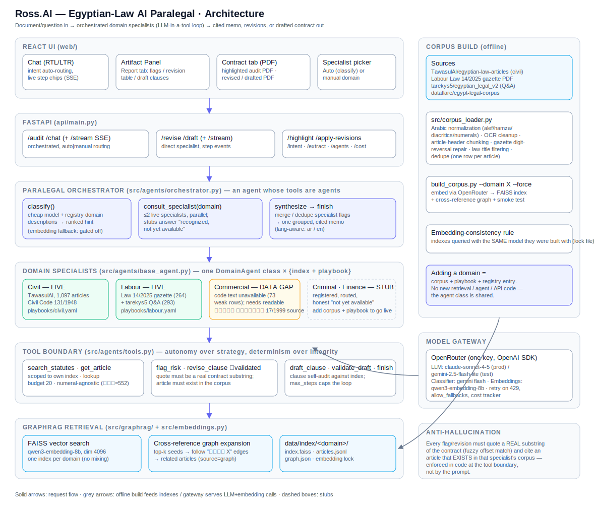

# Ross.AI — Architecture & Project Structure

**Egyptian-law AI paralegal**: feed it a contract (or a legal question, in Arabic or English) and it audits, explains, revises, or drafts — every legal claim grounded in a retrieved statute article and every quote validated against the actual document.



---

## 1. System overview

```
contract / question (AR or EN)
   → React UI  (intent detection → endpoint choice)
   → FastAPI   (upload/extract, SSE streaming)
   → Paralegal Orchestrator  (classify domains → consult ≤2 specialists → synthesize)
   → Domain Specialists      (same agent class × {index + playbook})
   → Tool boundary           (retrieval + validated flag/revise/draft actions)
   → GraphRAG retrieval      (FAISS vector search + cross-reference graph, per domain)
   → OpenRouter              (one key: reasoning LLM + embeddings)
   ← cited memo / revision table / drafted contract  (+ print-ready PDFs)
```

Two design commitments shape everything:

1. **Agents, not workflows.** Every specialist and the orchestrator is an LLM in a tool-use loop pursuing a goal ("audit this contract under Civil law; flag risks with citations"). Control flow emerges from the model — two contracts produce two different tool traces. The playbook is a *rubric the agent reasons with*, never a hardcoded `for check in checks` loop.
2. **Autonomy over strategy, determinism over integrity.** The agent decides what to search, which articles to follow, and when it's done — but it *cannot* emit a hallucinated citation: `flag_risk`/`revise_clause` reject any quote that isn't a real substring of the contract and any article that doesn't exist in the specialist's own corpus. Budgets (`AGENT_MAX_STEPS`, a 20-lookup `get_article` cap) bound the loop. Safety lives at the tool boundary, in code, not in the prompt.

---

## 2. Layers

### 2.1 React UI (`web/`)

Single-page chat app (Vite + React + TypeScript, RTL-aware, AR/EN i18n).

| Component | Role |
|---|---|
| `App.tsx` | Session state, intent routing (keyword + `/intent` LLM classifier with a hard no-contract gate), streaming consumers, **contract continuity** — a drafted document or applied revisions become the session contract for follow-ups |
| `components/ArtifactPanel.tsx` | Right panel, two tabs. **Report**: audit flags grouped by domain / 3-column revision table (الأصلي · المعدّل · السند القانوني) / draft clause citations. **Contract**: the PDF viewer |
| `components/MessageList.tsx`, `ThinkingSteps.tsx` | Chat transcript with live agent step chips streamed over SSE |
| `components/AgentPicker.tsx` | Auto (classify) or manual specialist selection from `GET /agents` |
| `components/ChatInput.tsx`, `Suggestions.tsx`, `HistorySidebar.tsx`, `TopBar.tsx` | Input + file upload, suggested prompts, conversation history, theme/language |
| `api/client.ts` | Typed fetch client incl. SSE consumers (`auditContractStream`, `chatWithParalegalStream`, `reviseContractStream`, `draftContractStream`), `highlightPdf`, `applyRevisionsPdf` |

**PDF viewing** (all fit-to-width via `#view=FitH`, value-keyed effects so blob URLs are fetched once, not in a re-render loop):
- *Audit* → `POST /highlight` returns the **original PDF** with evidence spans highlighted — overlapping flags keep the highest severity's color and a numbered badge per breach sits beside each highlight.
- *Revise* → `POST /apply-revisions` applies accepted changes to the contract text and renders a paginated, bidi-shaped RTL PDF.
- *Draft* → the assembled `document` rendered through the same PDF path.

### 2.2 API (`api/`)

FastAPI app (`api/main.py`) + Pydantic schemas (`api/schemas.py`).

| Endpoint | What it does |
|---|---|
| `POST /audit` (+ `/audit/stream`) | Upload → extract → orchestrator in audit mode. Returns `{routing, summary, flags_by_domain, specialist_results, trace}` |
| `POST /chat` (+ `/chat/stream`) | Question (+ optional contract + history) → orchestrator in chat mode, grounded and cited |
| `POST /revise` (+ `/revise/stream`) | Direct specialist revise → `{revisions: [{clause_original, clause_revised, article_ref, rationale}]}` |
| `POST /draft` (+ `/draft/stream`) | Direct specialist draft → `{drafts, document, warnings?}` — `document` is the full assembled contract |
| `POST /highlight` | Original PDF + flags → severity-colored highlights + numbered badges (fuzzy Arabic word-bag matching for OCR-noisy spans) |
| `POST /apply-revisions` | Contract text + revisions → print-ready RTL PDF (pymupdf `Story`, markdown bold rendered) |
| `POST /intent` | `{text, has_contract, has_audit}` → `{intent, domain}`; audit/revise are **coerced to chat in code** when no contract exists |
| `POST /extract` · `GET /agents` · `GET /cost` · `GET /health` | Text extraction, registry listing, cost telemetry, liveness |

All `/stream` endpoints emit SSE events: `step` (`{action, detail}` per tool call), then `done` (full result), or `error`.

### 2.3 Paralegal orchestrator (`src/agents/orchestrator.py`)

An agent whose tools are other agents: `classify` (cheap model ranks implicated domains using registry descriptions), `consult_specialist` (dispatches ≤2 live specialists, parallel), `synthesize`/`finish` (merge, dedupe, one grouped cited memo, in the requested language). Manual mode skips classification. Stub domains answer honestly ("recognized, not yet available"). When no contract is attached, the input prompt says so explicitly, so chat never implies a document was reviewed.

Routing hint fallback: an embedding-similarity ranker exists (`classifier.py`) but ships **gated off** (`CLASSIFIER_EMBED_FALLBACK`) — raw cosine scores aren't calibrated across heterogeneous indexes.

### 2.4 Domain specialists (`src/agents/base_agent.py`)

One `DomainAgent` class, many instances — a specialist is just `{name, index_path, playbook_path}`. Four goals share one loop (`_agent_loop_events`, a generator yielding step events for streaming):

- **audit** — probe clauses, retrieve articles, emit validated flags
- **chat** — answer under this domain's law with citations; state uncertainty
- **revise** — rewrite flagged clauses, preserving intent, citing the governing article
- **draft** — produce a **complete contract document** (title, تمهيد with party placeholders, numbered clauses, signature block) in the response language; clauses recorded via `draft_clause` are assembled into `document`; if a weak model writes plain text instead, the text is salvaged as the document with a `draft_not_grounded` warning

| Domain | Status | Corpus |
|---|---|---|
| Civil | **LIVE** | TawasulAI article-level bilingual (1,097 articles, Civil Code 131/1948) |
| Labour | **LIVE** | Official-gazette **Labour Law 14/2025** (264 articles) + law-title-filtered tarekys5 Q&A (293) — repealed 12/2003 dropped |
| Commercial | ⚠️ data gap | No readable قانون التجارة 17/1999 source yet (73 weak rows) — treat as stub-quality |
| Criminal, Finance | STUB | Registered for routing; honest "not available" |

### 2.5 Tool boundary (`src/agents/tools.py`)

`DomainTools` is instantiated per request with one index + one optional contract:

- `search_statutes(query)` — GraphRAG search scoped to **this** specialist's index
- `get_article(number)` — single-article fetch; capped at **20 lookups/run** (stops corpus-crawling); numeral-agnostic (`552` = `٥٥٢` = `مادة (552)`)
- `flag_risk(quote, article, severity, rationale)` — **validates** the quote is a real contract substring (fuzzy offset match) and resolves the article ref against the index; rejects otherwise
- `revise_clause(original, revised, article_ref, rationale)` — same validation on the original clause + article
- `draft_clause(topic, text, article_ref, rationale)` — article must exist; `validate_draft(text)` self-audits a clause against the index
- `finish(summary)` — the agent declares completion

### 2.6 GraphRAG retrieval (`src/graphrag/`, `src/embeddings.py`)

`GraphExpandedRetriever.search()`: FAISS vector top-k → take top seeds → follow cross-reference edges (`graph.json`, built by scanning article texts for "مادة X" references) up to 1 hop → append expanded articles tagged `retrieval_source: "graph_expansion"`. One `DomainIndex` per domain — a labour query never competes with civil articles, and one law changing means rebuilding one small index.

**Embedding-consistency rule:** every index is queried with the same model that built it (`qwen/qwen3-embedding-8b`, dim 4096), enforced by `embedding_model.lock`.

### 2.7 Corpus build (offline: `src/corpus_loader.py`, `build_corpus.py`)

`python build_corpus.py --domain {civil|labour|commercial} [--force]` → load + clean → chunk to articles → build graph → embed → write `data/index/<domain>/`.

Notable machinery (all born from real data problems — see `E2E_FINDINGS.md`):
- Arabic normalization (`src/arabic_normalize.py`): alef/hamza/taa-marbuta folding, diacritics/tatweel strip, Arabic-Indic↔ASCII numerals
- Article-header chunking tolerant of OCR text with no newlines; header-separator requirement so prose cross-references don't split articles
- **Gazette extractor** for Labour 14/2025: NFKC ligature folding + repair of *reversed digit runs* (article 142 extracts as `٢٤١`) by walking the ascending article sequence
- tarekys5 Q&A: filtered by **law title** (not Q&A body — stops cross-domain contamination), article number parsed from the title, deduped to one row per article
- `load_dataflare`: law-name filter + re-chunk of whole-law blobs

### 2.8 Model gateway (`src/llm_client.py`)

One OpenRouter key through the OpenAI SDK for both chat and embeddings. Models are runtime config (`.env`):

| Role | Production (`models-config.md`) | Cheap testing |
|---|---|---|
| Reasoning LLM | `anthropic/claude-sonnet-4-5` | `google/gemini-2.5-flash-lite` |
| Intake classifier | `google/gemini-2.5-flash` | `google/gemini-2.5-flash-lite` |
| Embeddings (fixed) | `qwen/qwen3-embedding-8b` | same — changing it breaks every index |

Resilience: retry with backoff on free-tier/upstream 429s, `allow_fallbacks` for provider outages, `src/cost_tracker.py` logs per-call usage to `data/cost_log.jsonl` (surfaced at `GET /cost`). Free models proved unable to sustain multi-step agent loops — use them only for single-shot calls.

---

## 3. Repository structure

```
Ross.AI/
├── AGENTS.md                    # build brief / agent design contract
├── ARCHITECTURE.md              # this document
├── E2E_FINDINGS.md              # Arabic e2e test report: findings + fixes + evidence
├── DECISIONS.md · models-config.md · playbook.yaml (legacy)
├── docs/
│   └── architecture.svg         # architecture diagram
├── playbooks/                   # per-domain audit rubrics (civil/commercial/labour .yaml)
├── data/
│   ├── corpus/<domain>/articles.jsonl     # cleaned article corpora (+ labour gazette PDF)
│   ├── index/<domain>/                    # index.faiss · articles.jsonl · graph.json ·
│   │                                      # metadata.json · embedding_model.lock
│   └── cost_log.jsonl
├── demo_contracts/              # deliberately flawed test contracts
├── eval/                        # ground-truth set (seeded from tarekys5)
├── src/
│   ├── llm_client.py            # OpenRouter chat + embeddings, retries, settings
│   ├── embeddings.py            # DomainIndex: FAISS build/load/search, numeral-agnostic lookup
│   ├── arabic_normalize.py      # normalization utilities
│   ├── corpus_loader.py         # source loaders, chunkers, gazette extractor
│   ├── contract_loader.py       # PDF/DOCX/TXT → text
│   ├── evidence_validation.py   # quote-substring + article-existence validation
│   ├── prompt_templates.py      # specialist + orchestrator prompts (audit/chat/revise/draft)
│   ├── cost_tracker.py
│   ├── agents/
│   │   ├── base_agent.py        # DomainAgent + streaming agent loop + document assembly
│   │   ├── tools.py             # DomainTools (validated tool boundary)
│   │   ├── orchestrator.py      # paralegal agent (classify/consult/synthesize), SSE
│   │   ├── classifier.py        # domain classifier + gated embedding fallback
│   │   ├── registry.py          # live + stub registry (labels, descriptions)
│   │   └── synthesizer.py       # memo merge/dedupe
│   ├── graphrag/
│   │   ├── builder.py           # cross-reference edge extraction → graph.json
│   │   └── retriever.py         # CrossReferenceGraph + GraphExpandedRetriever
│   └── audit_pipeline.py · playbook_loader.py
├── api/
│   ├── main.py                  # endpoints, SSE, /highlight, /apply-revisions, /intent gate
│   └── schemas.py
├── web/                         # React UI (see §2.1)
└── build_corpus.py              # corpus → graph → index CLI (+ retrieval smoke test)
```

---

## 4. Request flows

**Audit** — upload PDF → `/audit/stream` → orchestrator classifies (labour 0.94 …) → consults labour + civil in parallel → each specialist loops (search → fetch → `flag_risk`✓) → synthesizer merges → UI shows step chips, then the memo; contract tab shows the original PDF with severity-colored, numbered highlights.

**Chat** — question (+ session contract, last 8 turns, prior audit digest) → orchestrator → specialist answers with cited articles; with no contract attached it says so and asks for one.

**Revise** — session contract → specialist `revise_clause`✓ per fix → UI renders the 3-column change table + the revised-contract PDF; the revised text becomes the session contract.

**Draft** — contract type + requirements (AR/EN) → specialist searches, drafts clauses (`draft_clause`✓ + `validate_draft`), assembles the full document → UI shows cited clauses in Report, the contract PDF in Contract; the draft becomes the session contract for follow-ups.

---

## 5. Operational notes

- **Run:** `uvicorn api.main:app --port 8000` + `cd web && npm run dev`; `.env` from `.env.example` (single `OPENROUTER_API_KEY`).
- **Rebuild a corpus:** `python build_corpus.py --domain labour --force` (embeds ~hundreds of rows; cost is negligible; never change the embedding model).
- **Demo ops** (AGENTS.md §12): pre-load OpenRouter credits, prompt logging off, `allow_fallbacks` on.
- **Known gaps:** Commercial Code source (needs OCR or a text-layer PDF); Labour articles 249–266 (differently formatted gazette headers); classifier embedding-fallback calibration; production-model retest of structured revise/draft output. Details and evidence: `E2E_FINDINGS.md`.
